# CS331 Assignment 4

## Group 28

---

### Member 1 Details

*Name: Pranjal Baranwal*

*Roll Number: 200101083*

### Member 2 Details

*Name: Satvik Tiwari*

*Roll Number: 200101091*

---

## Part 1: KMeans Clustering

The required file is `KMeans.c`. 
Ouput files Generated: 

1. `outputKMeans.txt`: This file contains the cluster assignments of the points
2. `outputKMeansDescription.txt`: This file contains the description for each of the point along with the cluster assignments
3. `outputKMeansIntermediates.txt`: This file contains the description for the starting points of each iteration with the correspoinding final variances. Finally the best list of centroids along with the variance is returned.

>Lastly, the data values in `outputKMeans.txt` is used to plot the datas (taking two dimensions at a time), the corresponding code is present in `Plots.ipynb`

To run the file:
```C
    gcc KMeans.c
    ./a.out
```

---

## Part 2: LBG algorithm

The required file is `LBG.c`. Output files generated:

1. `outputLBG.txt`: This file contains the cluster assignments of the points.
2. `outputLBGDescription.txt`: This file contains the description for each of the point along with the cluster assignments.
3. `outputLBGCodebook.txt`: The final codebook containing the centroids of the representative set of the data.
4. `outputLBGintermediates.txt`: The centroids after each iteration of the code.

> Furthurmore, this prints the value of intermediate distortions. And the `outputLBG.txt` is later used to make the plots in `Plot.ipynb`.

Assumption
: M is of the form 2^k

To run the file:
```C
    gcc LBG.c
    ./a.out
```

---

## Final results and plots

There are various plots which are present in `plots` folder of the same directory.

The naming format of the plots is `Kmeans_plotX1_X2.jpeg` where X1 and X2 are the feature number. Similar convention is used for LBG plots.

Here are some of the comparisons:

### Feature 0 and 1

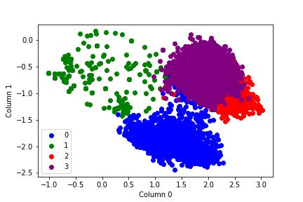

Kemans

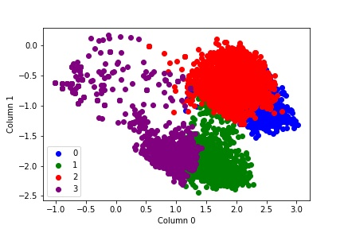

LBG

### Feature 2 and 3

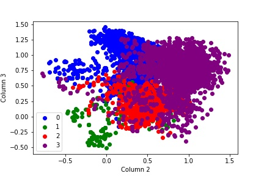

Kemans

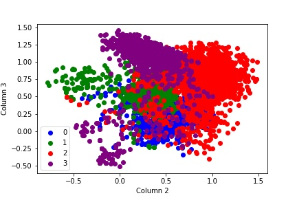

LBG

### Feature 4 and 5

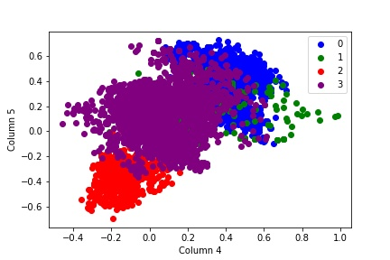

Kemans

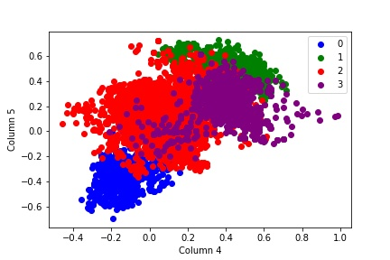

LBG

### Feature 6 and 7

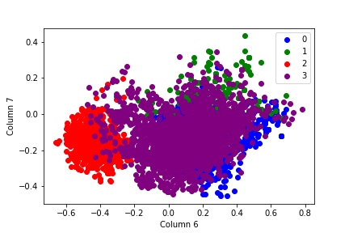

Kemans

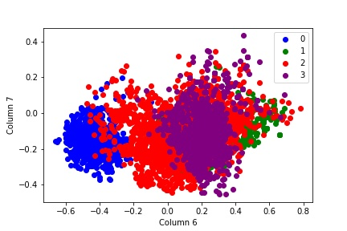

LBG

### Feature 8 and 9

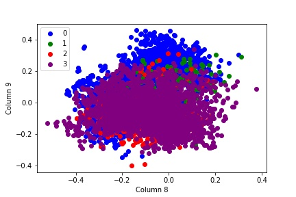

Kemans

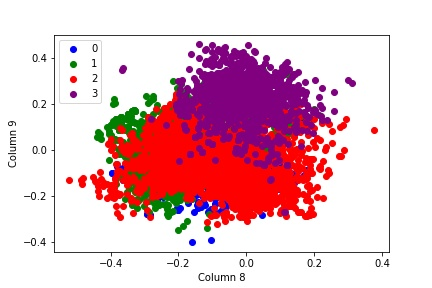

LBG

### Feature 10 and 11

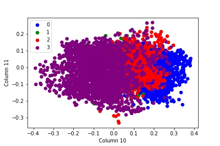

Kemans

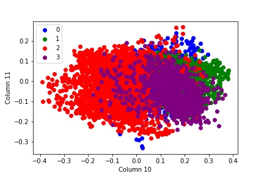

LBG

---

